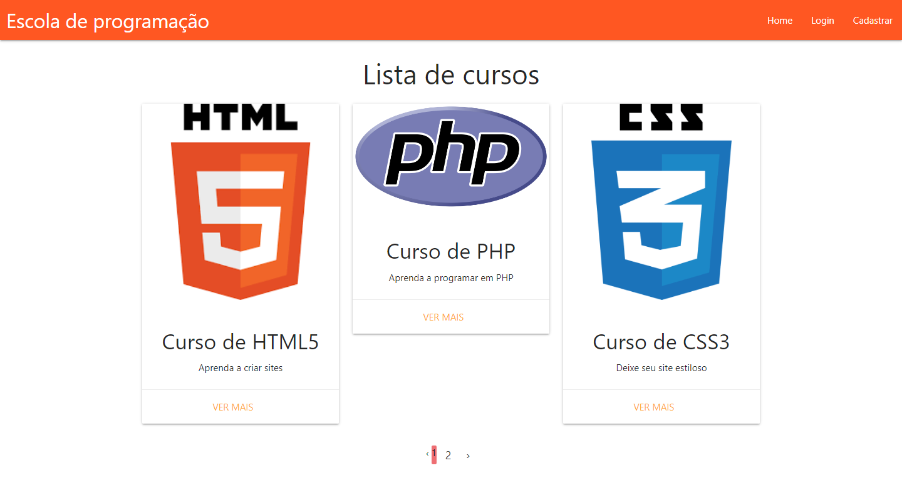

## Introdução

Este readme está dividido em:

- Introdução
- Descrição
- Funcionalidades
- Como instalar
- Imagem

## Descrição

Trata-se de um sistema desenvolvido em Laravel 5.3 para fins didáticos onde o usuário pode fazer login/cadastro, sendo direcionado para uma área protegida por autenticação onde ele pode inserir, alterar e deletar cursos de programação.

## Funcionalidades

Tela de Home: na tela de home temos uma lista de cards contendo cursos de programaçao. Esses cursos são listados diretamente do banco.

Tela de Login: ao realizar o login, se colocar senha ou email errado, o usuário é redirecionado para a 'home' e uma flash message será exibida e desaparecerá 3 segundos depois. Se o login ocorrer com sucesso, o usuário é redirecionado para a página de admin onde será possível adicionar, editar e remover cursos. Aqui também é exibida uma flash message de 3 segundos de duração.

Tela de admin: na página de admin o menu é alterado, contendo a opção "Cursos" e o nome da pessoa logada no sistema.

Tela de Cadastro de usuário: ao cadastrar, o usuário é redirecionado para a home e uma mensagem de flash message será exibida informando que o usuário se cadastrou com sucesso e desaparecerá 3 segundos depois. Se o usuário já for cadastrado, ele vai verificar pelo email e vai atualizar o nome a senha nova que foram digitadas. Também vai redirecionar o usuário para a página home com uma flash message de sucesso de 3 segundos.

Adicionar / Editar um curso: após logado, é possível adicionar e editar cursos e as informações do curso. No campo "publicação", se não for selecionado o checkbox, o curso não será publicado na página Home. Se for selecionado, ele será postado na página Home.

Deletar curso: ao clicar em deletar curso, ele será deletado na tabela do banco e consequentemente da página Home.

## Como instalar

Você vai precisar:
- [Wampserver](https://www.wampserver.com/en/)
- [Composer](https://getcomposer.org/)

O Wampserver vai simular um host local em sua máquina. Com ele também vem junto o MySQLWorkbench, onde vamos importar nosso banco de dados.

O Composer é um gerenciador de dependências do PHP.

Para instalar o Wampserver siga este [tutorial](https://www.devmedia.com.br/instalacao-do-wampserver/25871)

Após baixar e instalar o Composer, verifique se ele está nas variáveis de ambiente do sistema. Para verificar isso, abra o cmd, digite "composer" e dê enter. Se aparecer uma tela com a versão e os comandos, ele já está configurado. Caso contrário: no Windows 10, basta abrir o Menu Iniciar e digitar "variáveis". Depois clique em "Variáveis de ambiente"; depois em "Variáveis do sistema" dê um duplo clique em "Path", clique em "Novo" e digite o local onde ele foi instalado, por exemplo: "C:\ProgramData\ComposerSetup\bin". Depois basta clicar em 'ok' ou 'aplicar'.

Após instalar o Wampserver, abra seu navegador e digite "localhost" para ver se está tudo ok.

Clone o projeto para sua máquina, na pasta "C:\wamp64\www". Abra o Gitbash na pasta que você acabou de clonar e digite o comando:
> composer install

Agora, acesse este [tutorial](https://www.visualdicas.com.br/index.php/tools/web-server/4-como-alterar-um-servidor-virtual-wamp-server) para configurar o virtual host do Wamp.

Abra seu MySQLWorkbench e importe o arquivo de dump chamado "dump-escola-programacao" localizado na pasta
> public/dump

Nesse arquivo temos 5 cursos de exemplo e 1 conta de usuário que você pode usar para fazer login no sistema, basta digitar "admin@teste.com" no campo email e "123" no campo senha.

Depois de configurado o Virtual host, acesse "http://localhost/projeto-escola-de-programacao/" e clique em "public".

## Imagem do Projeto

Para mais imagens, acesse a pasta
> public/img

Página home:

